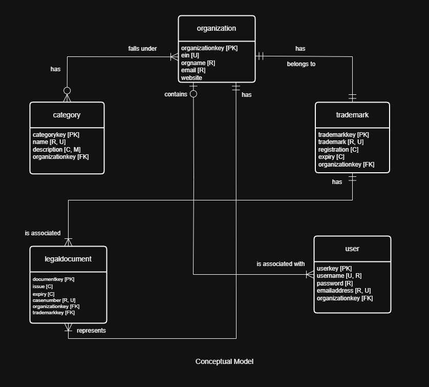
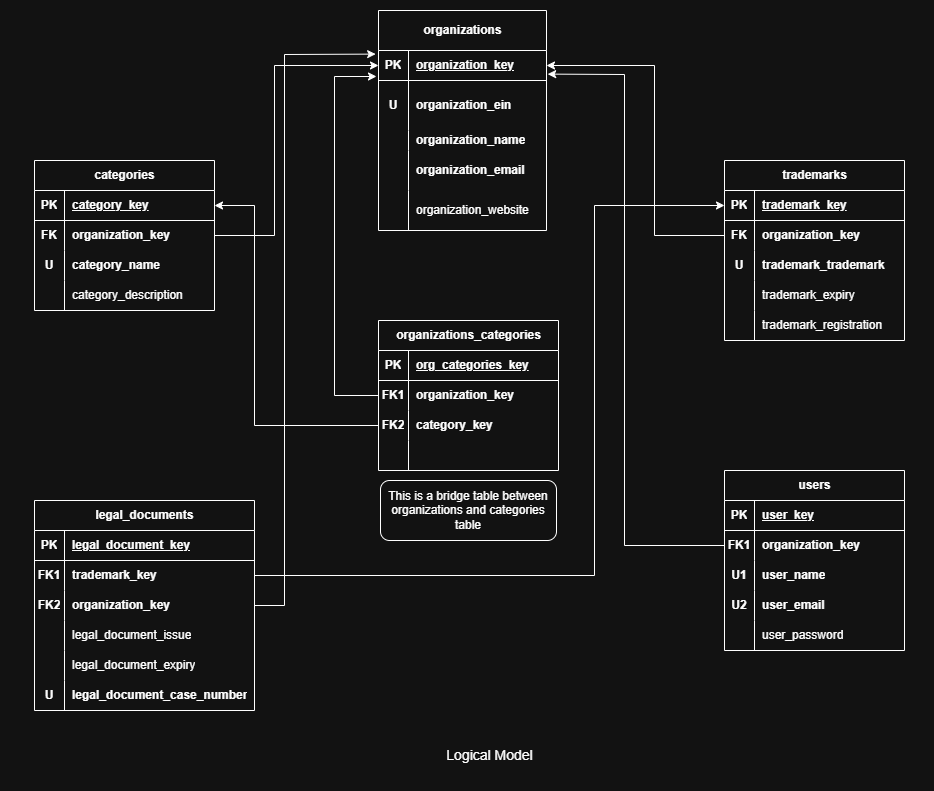

# Trademark Traverser

🔍 **Trademark Traverser** is a full-stack database application designed to streamline the management and exploration of trademark records. It combines a normalized relational schema with a no-code frontend built in **Microsoft Power Apps**, enabling intuitive, real-time access to trademark data.

---

## 📺 Demo

🎥 [Watch Full Application Demo (MP4)](./demo.mp4)  
*A complete walkthrough of the Trademark Traverser application, including the Power Apps frontend and SQL backend.*

---

## 🧠 Conceptual Overview

The system models the relationships between applicants, trademarks, classifications, and historical legal statuses. Each applicant can apply for multiple trademarks, which are categorized by classification and tracked over time through status and event updates. This structure enables powerful data retrieval, such as tracking trademarks by applicant, analyzing classification trends, and reviewing the complete legal lifecycle of a trademark.

---

## 🖼️ Data Models

### Conceptual Model  

### Logical Model  

These models were created using draw.io and follow best practices for normalization and referential integrity.

---

## 🛠️ Tools Used

- **Azure Data Studio** – For developing and testing SQL queries  
- **draw.io** – For creating and editing ER diagrams  
- **Microsoft Power Apps** – For building the no-code frontend interface

---

## 🚀 Features

- ✅ Normalized relational schema (3NF)  
- 📊 Power Apps frontend for real-time interaction  
- 📌 Entity-relationship and logical diagrams in `.png` format  
- 🔍 Sample SQL queries for real-world analysis use cases

---

## 🙌 Acknowledgments

This project was developed as part of a database systems course, combining data modeling principles with no-code development tools to deliver a complete and interactive solution.
